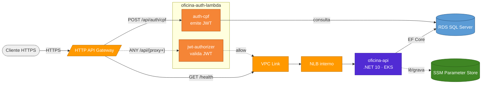
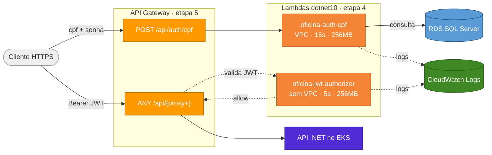

# oficina-auth-lambda

Funções *serverless* de autenticação e autorização da solução Oficina.

[]()
[]()
[]()
[](https://github.com/fabianorodrigues/oficina-auth-lambda/actions/workflows/ci.yml)
[](https://github.com/fabianorodrigues/oficina-auth-lambda/actions/workflows/deploy-lambda.yml)

## Sumário

- [Visão geral](#visão-geral)
- [Solução integrada](#solução-integrada)
- [Arquitetura](#arquitetura)
- [As duas Lambdas](#as-duas-lambdas)
- [Consumido e gerado](#consumido-e-gerado)
- [Pré-requisitos manuais](#pré-requisitos-manuais)
- [Configuração](#configuração)
- [Execução](#execução)
- [Validação](#validação)
- [Execução local](#execução-local)
- [Observabilidade](#observabilidade)
- [Próxima etapa](#próxima-etapa)

---

## <a id="visão-geral"></a> Visão geral

Este repositório corresponde à etapa 4 da solução Oficina. Duas funções AWS Lambda em .NET 10:

- **`oficina-auth-cpf`** — valida CPF, consulta cliente ou funcionário no SQL Server e emite o JWT.
- **`oficina-jwt-authorizer`** — valida JWT nas rotas protegidas do API Gateway, atuando como *Lambda Authorizer*.

As Lambdas são publicadas após o 1º *deploy* da API (RDS já migrado) e antes da criação do API Gateway.

- O workflow constrói o pacote ZIP, executa testes unitários e empacota o artefato.
- Cria ou atualiza ambas as funções na AWS de forma idempotente.
- Não cria a IAM Role das Lambdas (pré-requisito manual) nem o API Gateway (provisionado na etapa 5 do `oficina-infra-k8s`).

**Tecnologias:** .NET 10, AWS Lambda (runtime `dotnet10`), AWS API Gateway *Lambda Authorizer*, AWS VPC e RDS SQL Server, CloudWatch Logs, GitHub Actions.

---

## <a id="solução-integrada"></a> Solução integrada

A solução Oficina é composta por 4 repositórios que formam, em conjunto, um sistema de gestão de oficina mecânica na AWS. O diagrama abaixo mostra o **fluxo de runtime** (setas sólidas) e o **fluxo de configuração** entre componentes (setas tracejadas).



| Passo | Repositório | Quando |
|---|---|---|
| 1 | [oficina-infra-db](https://github.com/fabianorodrigues/oficina-infra-db) | sempre |
| 2 | [oficina-infra-k8s](https://github.com/fabianorodrigues/oficina-infra-k8s) — core + addons | sempre |
| 3 | [oficina-api](https://github.com/fabianorodrigues/oficina-api) — 1º deploy | sempre |
| **4** | **[oficina-auth-lambda](https://github.com/fabianorodrigues/oficina-auth-lambda)** | **sempre — este repositório** |
| 5 | [oficina-infra-k8s](https://github.com/fabianorodrigues/oficina-infra-k8s) — api-gateway | sempre |
| 6 | [oficina-api](https://github.com/fabianorodrigues/oficina-api) — redeploy | opcional, se `public-base-url` precisa entrar nos e-mails |
| 7 | [oficina-infra-k8s](https://github.com/fabianorodrigues/oficina-infra-k8s) — root `observability` | sempre, após a etapa 5 |

---

## <a id="arquitetura"></a> Arquitetura



O fluxo do JWT é assimétrico: `auth-cpf` emite o token, entrega ao cliente, e o cliente o reapresenta como `Bearer` na próxima requisição protegida. O API Gateway delega a validação ao `jwt-authorizer`, que aprova ou nega o acesso ao backend EKS — sem que as duas Lambdas precisem se comunicar diretamente.

---

## <a id="as-duas-lambdas"></a> As duas Lambdas

| Função | Memória | Timeout | VPC | Acesso ao RDS | Variáveis de ambiente |
| --- | --- | --- | --- | --- | --- |
| `oficina-auth-cpf` | 256 MB | 15 s | sim | sim | JWT (4) + `ConnectionStrings__SqlServer` |
| `oficina-jwt-authorizer` | 256 MB | 5 s | não | não | apenas JWT (4) |

> [!NOTE]
> A função `auth-cpf` precisa de VPC para consultar o RDS. A `jwt-authorizer` apenas valida o token (operação puramente local) — sem VPC fica mais rápida e sem o *cold start* relativo à criação de ENI.

Handlers configurados pelo workflow:

| Função | Handler |
| --- | --- |
| `oficina-auth-cpf` | `Oficina.AuthLambda::Oficina.AuthLambda.Functions.AuthCpfFunction::HandleAsync` |
| `oficina-jwt-authorizer` | `Oficina.AuthLambda::Oficina.AuthLambda.Functions.JwtAuthorizerFunction::HandleAsync` |

---

## <a id="consumido-e-gerado"></a> Consumido e gerado

**Consome:**

| Origem | Valores |
| --- | --- |
| `oficina-infra-db` | `db_address`, `db_port` (compõem `DB_CONNECTION_STRING`), `lambda_subnet_id`, `lambda_security_group_id` |
| `oficina-api` (etapa 3) | RDS já migrado (tabelas `Clientes` e `Funcionarios`) |
| `oficina-api` | JWT (`JWT_SECRET`, `JWT_ISSUER`, `JWT_AUDIENCE`, `JWT_EXPIRATION_MINUTES`) — idênticos |

**Gera:**

| Saída | Consumido por |
| --- | --- |
| Funções Lambda `auth-cpf` e `jwt-authorizer` | api-gateway (etapa 5) |
| CloudWatch Log Groups `/aws/lambda/<nome>` | observabilidade |

---

## <a id="pré-requisitos-manuais"></a> Pré-requisitos manuais

> [!IMPORTANT]
> O workflow **não cria** a IAM Role. Crie a role uma vez e referencie pelo secret `AWS_LAMBDA_ROLE_ARN`. As duas funções compartilham a mesma role.

| Item | Valor |
| --- | --- |
| Trust policy | `lambda.amazonaws.com` |
| Política gerenciada | `AWSLambdaBasicExecutionRole` (logs CloudWatch) |
| Política gerenciada | `AWSLambdaVPCAccessExecutionRole` (necessária para `auth-cpf`) |

> [!IMPORTANT]
> A **etapa 3 (`oficina-api`) deve estar concluída** antes deste deploy — sem o RDS migrado, a Lambda `auth-cpf` falha ao consultar `Cliente` ou `Funcionario`.

Criação da role (PowerShell):

```powershell
$env:AWS_REGION="<regiao>"

$trust = @'
{
  "Version": "2012-10-17",
  "Statement": [
    { "Effect": "Allow", "Principal": { "Service": "lambda.amazonaws.com" }, "Action": "sts:AssumeRole" }
  ]
}
'@
$trust | Out-File -Encoding ascii -FilePath trust-lambda.json

aws iam create-role --role-name "oficina-auth-lambda-role" --assume-role-policy-document file://trust-lambda.json --query "Role.RoleName"

$basicPolicyArn = aws iam list-policies --scope AWS --query "Policies[?PolicyName=='AWSLambdaBasicExecutionRole'].Arn | [0]" --output text
$vpcPolicyArn = aws iam list-policies --scope AWS --query "Policies[?PolicyName=='AWSLambdaVPCAccessExecutionRole'].Arn | [0]" --output text

aws iam attach-role-policy --role-name "oficina-auth-lambda-role" --policy-arn $basicPolicyArn
aws iam attach-role-policy --role-name "oficina-auth-lambda-role" --policy-arn $vpcPolicyArn

aws iam get-role --role-name "oficina-auth-lambda-role" --query "Role.Arn" --output text
```

Use o ARN retornado como valor do secret `AWS_LAMBDA_ROLE_ARN`.

---

## <a id="configuração"></a> Configuração

Configure em **GitHub > Settings > Secrets and variables > Actions**.

> [!IMPORTANT]
> **JWT idêntico** ao [oficina-api](https://github.com/fabianorodrigues/oficina-api): se `JWT_SECRET`, `JWT_ISSUER`, `JWT_AUDIENCE` ou `JWT_EXPIRATION_MINUTES` divergir, os tokens emitidos por estas Lambdas não são aceitos pela API.

### AWS e role

| Nome | Tipo | Obrigatório | Descrição |
| --- | --- | --- | --- |
| `AWS_ACCESS_KEY_ID`, `AWS_SECRET_ACCESS_KEY`, `AWS_REGION` | Secret | sim | Credenciais AWS |
| `AWS_SESSION_TOKEN` | Secret | não | Credenciais temporárias (STS, opcional) |
| `AWS_LAMBDA_ROLE_ARN` | Secret | sim | ARN da IAM Role compartilhada (ver pré-requisitos) |

### VPC e banco

| Nome | Tipo | Obrigatório | Descrição |
| --- | --- | --- | --- |
| `DB_CONNECTION_STRING` | Secret | sim | *Connection string* do SQL Server |
| `LAMBDA_SUBNET_IDS` | Secret | sim | IDs de *subnets* privadas em CSV (formato `subnet-xxxxxxxx`) |
| `LAMBDA_SECURITY_GROUP_IDS` | Secret | sim | IDs de *Security Groups* em CSV (formato `sg-xxxxxxxx`) |

### JWT

| Nome | Tipo | Obrigatório | Descrição |
| --- | --- | --- | --- |
| `JWT_SECRET` | Secret | sim | Chave de assinatura (mínimo 32 caracteres, HS256) |
| `JWT_ISSUER` | Secret | sim | Issuer JWT |
| `JWT_AUDIENCE` | Secret | sim | Audience JWT |
| `JWT_EXPIRATION_MINUTES` | Secret | sim | Expiração do token, em minutos (inteiro positivo) |

### Nomes das funções

| Nome | Tipo | Default | Descrição |
| --- | --- | --- | --- |
| `AUTH_FUNCTION_NAME` | Variable | `oficina-auth-cpf` | Nome da Lambda de autenticação |
| `AUTHORIZER_FUNCTION_NAME` | Variable | `oficina-jwt-authorizer` | Nome da Lambda *authorizer* |

### Auto-provisionado pelo workflow

Criação ou atualização das duas Lambdas (runtime, memória, timeout, VPC config apenas para `auth-cpf`, variáveis de ambiente e handlers). Todas as operações são idempotentes: o workflow aplica `update-function-code` + `update-function-configuration` quando a função já existe.

### Como obter `LAMBDA_SUBNET_IDS` e `LAMBDA_SECURITY_GROUP_IDS`

```powershell
$env:AWS_REGION="<regiao>"
$env:PROJECT_NAME="oficina"

aws ec2 describe-subnets --region $env:AWS_REGION `
  --filters "Name=tag:Name,Values=*$($env:PROJECT_NAME)*private*" `
  --query "Subnets[*].SubnetId" --output text

aws ec2 describe-security-groups --region $env:AWS_REGION `
  --filters "Name=tag:Name,Values=*$($env:PROJECT_NAME)*lambda*" `
  --query "SecurityGroups[*].GroupId" --output text
```

Quando houver mais de um identificador, separe por vírgula.

---

## <a id="execução"></a> Execução

O deploy só pode ser disparado da branch `main`:

```text
GitHub Actions > Deploy Lambda > Run workflow
```

O workflow valida secrets e configuração, compila a solução, executa testes unitários, empacota o ZIP, cria ou atualiza as duas Lambdas e valida a configuração final sem expor secrets, *connection string*, ARNs ou demais dados sensíveis em log.

---

## <a id="validação"></a> Validação

### Console

- **Lambda**: ambas as funções ativas, com `LastUpdateStatus=Successful`.
- **`auth-cpf`**: VPC, *subnets* e *Security Groups* configurados.
- **`jwt-authorizer`**: ausência de VPC.
- **Configuration > Environment variables**: variáveis JWT presentes (sem expor os valores).

### CLI (PowerShell)

```powershell
$env:AWS_REGION="<regiao>"
$env:AUTH_FUNCTION_NAME="oficina-auth-cpf"
$env:AUTHORIZER_FUNCTION_NAME="oficina-jwt-authorizer"
$lambdaConfigQuery = '{State:State,LastUpdateStatus:LastUpdateStatus,Runtime:Runtime,Timeout:Timeout,MemorySize:MemorySize,SubnetCount:length(not_null(VpcConfig.SubnetIds, `[]`)),SecurityGroupCount:length(not_null(VpcConfig.SecurityGroupIds, `[]`))}'

aws lambda get-function-configuration --function-name $env:AUTH_FUNCTION_NAME --region $env:AWS_REGION --query $lambdaConfigQuery
aws lambda get-function-configuration --function-name $env:AUTHORIZER_FUNCTION_NAME --region $env:AWS_REGION --query $lambdaConfigQuery
```

Esperado: `auth-cpf` com `SubnetCount >= 1` e `SecurityGroupCount >= 1`; `authorizer` com ambos `0`.

---

## <a id="execução-local"></a> Execução local

Não há Docker Compose neste repositório. Localmente é possível apenas compilar e rodar os testes unitários. A validação funcional requer Lambda já implantada.

```powershell
dotnet restore Oficina.AuthLambda.sln
dotnet build Oficina.AuthLambda.sln --configuration Release --no-restore
dotnet test Oficina.AuthLambda.sln --configuration Release --no-build
```

### Invocação com payloads (requer Lambdas implantadas)

Crie os arquivos abaixo na raiz do repositório.

`payload-cliente.json`:

```json
{
  "version": "2.0",
  "headers": { "content-type": "application/json" },
  "isBase64Encoded": false,
  "body": "{\"cpf\":\"<cpf-do-cliente>\"}"
}
```

`payload-authorizer.json`:

```json
{
  "version": "2.0",
  "headers": { "authorization": "Bearer <jwt-emitido-pela-auth-cpf>" }
}
```

Invocar:

```powershell
$env:AWS_REGION="<regiao>"
$env:AUTH_FUNCTION_NAME="oficina-auth-cpf"
$env:AUTHORIZER_FUNCTION_NAME="oficina-jwt-authorizer"

aws lambda invoke --function-name $env:AUTH_FUNCTION_NAME --region $env:AWS_REGION `
  --payload file://payload-cliente.json --cli-binary-format raw-in-base64-out `
  response-local.json; Get-Content response-local.json

aws lambda invoke --function-name $env:AUTHORIZER_FUNCTION_NAME --region $env:AWS_REGION `
  --payload file://payload-authorizer.json --cli-binary-format raw-in-base64-out `
  response-authorizer-local.json; Get-Content response-authorizer-local.json
```

---

## <a id="observabilidade"></a> Observabilidade

Na observabilidade da solução, as Lambdas emitem logs estruturados em JSON no CloudWatch, com `correlationId = context.AwsRequestId`. Registram sucesso e falha de autenticação por CPF, além de `allow`/`deny`/falha do *authorizer*.

> [!TIP]
> Os logs não contêm CPF completo, senha, JWT, header `Authorization` nem *connection string*. A redação acontece no `SafeLambdaLogger`.

### Configurar

Nenhum secret adicional é necessário. A IAM Role configurada como `AWS_LAMBDA_ROLE_ARN` já contém `AWSLambdaBasicExecutionRole` (pré-requisito), habilitando os logs no CloudWatch automaticamente.

### Validar

**Console (CloudWatch > Logs > Log groups)**

- Invocar `auth-cpf` com payload válido: confirmar `eventType=AutenticacaoCpf`, `outcome=success` e presença de `correlationId`.
- Invocar `auth-cpf` com payload inválido: confirmar `outcome=failure`, sem CPF completo no log.
- Invocar `jwt-authorizer` com token válido ou inválido: confirmar `eventType=JwtAuthorizer`, `outcome=allow` ou `deny`.

**CLI (PowerShell)**

```powershell
$env:AWS_REGION="<regiao>"
$env:AUTH_FUNCTION_NAME="oficina-auth-cpf"

aws logs describe-log-streams --log-group-name "/aws/lambda/$($env:AUTH_FUNCTION_NAME)" `
  --region $env:AWS_REGION --order-by LastEventTime --descending --max-items 1 `
  --query "logStreams[0].logStreamName"

aws logs filter-log-events --log-group-name "/aws/lambda/$($env:AUTH_FUNCTION_NAME)" `
  --region $env:AWS_REGION --filter-pattern "eventType" --max-items 5 `
  --query "events[*].message"
```

---

## <a id="próxima-etapa"></a> Próxima etapa

Aplicar o root `terraform/api-gateway` do [oficina-infra-k8s](https://github.com/fabianorodrigues/oficina-infra-k8s) — **etapa 5** — para criar a entrada pública e integrar a API, `auth-cpf` e `jwt-authorizer`. Após a URL pública estar validada, aplicar o root `observability` da **etapa 7** para a observabilidade da solução.

> [!TIP]
> **Checkpoint antes da etapa 5:** ambas as funções com `LastUpdateStatus=Successful`; `oficina-auth-cpf` com `VpcConfig` (subnets + security groups) e `oficina-jwt-authorizer` sem VPC. JWT (`Secret`, `Issuer`, `Audience`, `ExpirationMinutes`) idêntico ao configurado no [oficina-api](https://github.com/fabianorodrigues/oficina-api).
