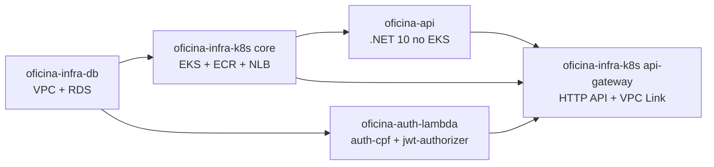
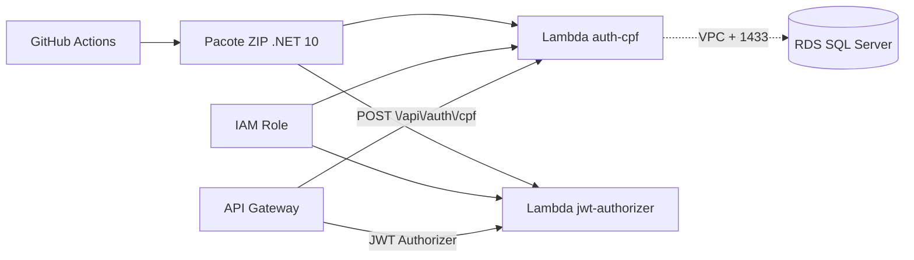

# oficina-auth-lambda

## Visão geral

Repositório das funções serverless de autenticação e autorização da solução Oficina, em .NET 10:

- `oficina-auth-cpf`: valida CPF, consulta cliente ou funcionário no SQL Server e emite JWT.
- `oficina-jwt-authorizer`: valida JWT nas rotas protegidas do API Gateway.

As Lambdas são publicadas depois do primeiro deploy da API (banco já migrado) e antes da criação do API Gateway.

- Constrói o pacote ZIP .NET 10 das Lambdas, executa testes e empacota o artefato.
- Cria ou atualiza as duas funções Lambda na conta AWS (idempotente).
- Não cria a IAM role das Lambdas (pré-requisito manual) nem o API Gateway (provisionado pelo [oficina-infra-k8s](https://github.com/fabianorodrigues/oficina-infra-k8s) root `api-gateway`).

## Tecnologias utilizadas

- .NET 10
- AWS Lambda com runtime `dotnet10`
- AWS API Gateway Authorizer
- AWS VPC e RDS SQL Server
- AWS CloudWatch Logs (logs estruturados)
- GitHub Actions

## Solução integrada

A solução Oficina é composta por 4 repositórios que formam um sistema de gestão de oficina mecânica na AWS.



| Passo | Repositório | Quando aplicar |
|---|---|---|
| 1 | [oficina-infra-db](https://github.com/fabianorodrigues/oficina-infra-db) | sempre |
| 2 | [oficina-infra-k8s](https://github.com/fabianorodrigues/oficina-infra-k8s) — core | sempre |
| 2a | [oficina-infra-k8s](https://github.com/fabianorodrigues/oficina-infra-k8s) — addons | apenas se `LOAD_BALANCER_PROVISIONING_MODE=aws_lbc` |
| 3 | [oficina-api](https://github.com/fabianorodrigues/oficina-api) | sempre |
| 4 | [oficina-auth-lambda](https://github.com/fabianorodrigues/oficina-auth-lambda) | sempre |
| 5 | [oficina-infra-k8s](https://github.com/fabianorodrigues/oficina-infra-k8s) — api-gateway | sempre |
| 6 | [oficina-api](https://github.com/fabianorodrigues/oficina-api) — redeploy | se o pod precisar refletir `public-base-url` em e-mails |
| 7 | [oficina-infra-k8s](https://github.com/fabianorodrigues/oficina-infra-k8s) — observability | opcional — somente após passo 5 |

Cada README detalha apenas a responsabilidade do seu repositório. Para o passo a passo dos demais, consulte os READMEs correspondentes.

## Arquitetura



## As duas Lambdas

| Função | Memória | Timeout | VPC | Acesso ao RDS | Variáveis |
| --- | --- | --- | --- | --- | --- |
| `oficina-auth-cpf` | 256 MB | 15 s | sim | sim | JWT (4) + `ConnectionStrings__SqlServer` |
| `oficina-jwt-authorizer` | 256 MB | 5 s | não | não | apenas JWT (4) |

## Pré-requisito manual — IAM Role das Lambdas

O workflow **não cria** a IAM role; ela é referenciada pelo Secret `AWS_LAMBDA_ROLE_ARN`. Uma única role é compartilhada pelas duas funções.

- Trust policy: `lambda.amazonaws.com`
- Políticas gerenciadas:
  - `AWSLambdaBasicExecutionRole` (logs CloudWatch — necessária para ambas)
  - `AWSLambdaVPCAccessExecutionRole` (necessária para `auth-cpf`; a `jwt-authorizer` herda sem prejuízo)

Para criar a role (PowerShell):

```powershell
$env:AWS_REGION="<regiao>"

$trust = @'
{
  "Version": "2012-10-17",
  "Statement": [
    { "Effect": "Allow", "Principal": { "Service": "lambda.amazonaws.com" }, "Action": "sts:AssumeRole" }
  ]
}
'@

$trust | Out-File -Encoding ascii -FilePath trust-lambda.json

aws iam create-role --role-name "oficina-auth-lambda-role" --assume-role-policy-document file://trust-lambda.json --query "Role.RoleName"

$basicPolicyArn = aws iam list-policies --scope AWS --query "Policies[?PolicyName=='AWSLambdaBasicExecutionRole'].Arn | [0]" --output text
$vpcPolicyArn = aws iam list-policies --scope AWS --query "Policies[?PolicyName=='AWSLambdaVPCAccessExecutionRole'].Arn | [0]" --output text

aws iam attach-role-policy --role-name "oficina-auth-lambda-role" --policy-arn $basicPolicyArn
aws iam attach-role-policy --role-name "oficina-auth-lambda-role" --policy-arn $vpcPolicyArn

aws iam get-role --role-name "oficina-auth-lambda-role" --query "Role.Arn" --output text
```

Configure o ARN retornado como o Secret `AWS_LAMBDA_ROLE_ARN`.

## Configuração

Configure em `GitHub > Settings > Secrets and variables > Actions`.

> **JWT idêntico**: `JWT_SECRET`, `JWT_ISSUER`, `JWT_AUDIENCE` e `JWT_EXPIRATION_MINUTES` devem ser os mesmos valores configurados no [oficina-api](https://github.com/fabianorodrigues/oficina-api). Tokens emitidos por estas Lambdas só são validados pela API se as quatro variáveis baterem.

### Obrigatório

| Nome | Tipo | Descrição |
| --- | --- | --- |
| `AWS_ACCESS_KEY_ID` | Secret | Credencial AWS |
| `AWS_SECRET_ACCESS_KEY` | Secret | Credencial AWS |
| `AWS_REGION` | Secret | Região AWS |
| `AWS_LAMBDA_ROLE_ARN` | Secret | ARN da IAM role compartilhada (ver pré-requisito) |
| `DB_CONNECTION_STRING` | Secret | Connection string com o SQL Server (composta a partir do [oficina-infra-db](https://github.com/fabianorodrigues/oficina-infra-db)) |
| `LAMBDA_SUBNET_IDS` | Secret | IDs das subnets privadas em CSV (obtidos do [oficina-infra-db](https://github.com/fabianorodrigues/oficina-infra-db)) |
| `LAMBDA_SECURITY_GROUP_IDS` | Secret | IDs dos Security Groups em CSV (obtidos do [oficina-infra-db](https://github.com/fabianorodrigues/oficina-infra-db)) |
| `JWT_SECRET` | Secret | Chave de assinatura JWT (mínimo 32 caracteres) — idêntico ao [oficina-api](https://github.com/fabianorodrigues/oficina-api) |
| `JWT_ISSUER` | Secret | Issuer JWT — idêntico ao [oficina-api](https://github.com/fabianorodrigues/oficina-api) |
| `JWT_AUDIENCE` | Secret | Audience JWT — idêntico ao [oficina-api](https://github.com/fabianorodrigues/oficina-api) |
| `JWT_EXPIRATION_MINUTES` | Secret | Expiração dos tokens em minutos — idêntico ao [oficina-api](https://github.com/fabianorodrigues/oficina-api) |

### Opcional

| Nome | Tipo | Default | Descrição |
| --- | --- | --- | --- |
| `AWS_SESSION_TOKEN` | Secret | — | Credenciais temporárias (STS) |
| `AUTH_FUNCTION_NAME` | Variable | `oficina-auth-cpf` | Nome da Lambda de autenticação |
| `AUTHORIZER_FUNCTION_NAME` | Variable | `oficina-jwt-authorizer` | Nome da Lambda authorizer |

### Auto-provisionado pelo workflow

Criação ou atualização das duas funções Lambda com runtime, memória, timeout, VPC config (apenas na `auth-cpf`) e variáveis de ambiente.

### Obtendo LAMBDA_SUBNET_IDS e LAMBDA_SECURITY_GROUP_IDS

Após o deploy do [oficina-infra-db](https://github.com/fabianorodrigues/oficina-infra-db):

```powershell
$env:AWS_REGION="<regiao>"
$env:PROJECT_NAME="oficina"

aws ec2 describe-subnets --region $env:AWS_REGION `
  --filters "Name=tag:Name,Values=*$($env:PROJECT_NAME)*private*" `
  --query "Subnets[*].SubnetId" --output text

aws ec2 describe-security-groups --region $env:AWS_REGION `
  --filters "Name=tag:Name,Values=*$($env:PROJECT_NAME)*lambda*" `
  --query "SecurityGroups[*].GroupId" --output text
```

Configure os valores como `LAMBDA_SUBNET_IDS` e `LAMBDA_SECURITY_GROUP_IDS`, separados por vírgula quando houver mais de um ID.

## Execução

O deploy manual deve ser disparado a partir da branch `main`:

```text
GitHub Actions > Deploy Lambda > Run workflow
```

O workflow valida configuração, compila, testa, empacota, cria ou atualiza as duas Lambdas e valida a configuração final sem imprimir secrets, connection string, ARNs ou dados sensíveis.

## Validação

### Console

- Em Lambda, confirme as duas funções ativas.
- Na Lambda Auth, confirme VPC, subnets e Security Groups configurados.
- Na Lambda Authorizer, confirme ausência de VPC.
- Em Configuration > Environment variables, confirme variáveis JWT existentes sem expor seus valores.

### CLI (PowerShell)

```powershell
$env:AWS_REGION="<regiao>"
$env:AUTH_FUNCTION_NAME="oficina-auth-cpf"
$env:AUTHORIZER_FUNCTION_NAME="oficina-jwt-authorizer"
$lambdaConfigQuery = '{State:State,LastUpdateStatus:LastUpdateStatus,Runtime:Runtime,Timeout:Timeout,MemorySize:MemorySize,SubnetCount:length(not_null(VpcConfig.SubnetIds, `[]`)),SecurityGroupCount:length(not_null(VpcConfig.SecurityGroupIds, `[]`))}'

aws lambda get-function-configuration --function-name $env:AUTH_FUNCTION_NAME --region $env:AWS_REGION --query $lambdaConfigQuery
aws lambda get-function-configuration --function-name $env:AUTHORIZER_FUNCTION_NAME --region $env:AWS_REGION --query $lambdaConfigQuery
```

Resultado esperado: `auth-cpf` com `SubnetCount >= 1` e `SecurityGroupCount >= 1`; `authorizer` com ambos iguais a `0`.

## Execução local

Não há Docker Compose. Localmente é possível apenas compilar e rodar os testes unitários. Validação funcional requer Lambda já implantada.

Build e testes:

```powershell
dotnet restore Oficina.AuthLambda.sln
dotnet build Oficina.AuthLambda.sln --configuration Release --no-restore
dotnet test Oficina.AuthLambda.sln --configuration Release --no-build
```

Invocação com payloads de exemplo (requer AWS CLI e Lambdas já implantadas). Crie os arquivos na raiz do repositório:

`payload-cliente.json`:

```json
{
  "version": "2.0",
  "headers": {
    "content-type": "application/json"
  },
  "isBase64Encoded": false,
  "body": "{\"cpf\":\"<cpf-do-cliente>\"}"
}
```

`payload-authorizer.json`:

```json
{
  "version": "2.0",
  "headers": {
    "authorization": "Bearer <jwt-gerado-pela-lambda-auth>"
  }
}
```

```powershell
$env:AWS_REGION="<regiao>"
$env:AUTH_FUNCTION_NAME="oficina-auth-cpf"
$env:AUTHORIZER_FUNCTION_NAME="oficina-jwt-authorizer"

aws lambda invoke --function-name $env:AUTH_FUNCTION_NAME --region $env:AWS_REGION `
  --payload file://payload-cliente.json --cli-binary-format raw-in-base64-out `
  response-local.json; Get-Content response-local.json

aws lambda invoke --function-name $env:AUTHORIZER_FUNCTION_NAME --region $env:AWS_REGION `
  --payload file://payload-authorizer.json --cli-binary-format raw-in-base64-out `
  response-authorizer-local.json; Get-Content response-authorizer-local.json
```

## Observabilidade

As Lambdas emitem logs estruturados em JSON no CloudWatch usando `correlationId = context.AwsRequestId`. Registram sucesso e falha de autenticação por CPF e allow, deny ou falha do authorizer, sem expor CPF completo, senha, JWT ou connection string.

### Configurar

- Não há secrets adicionais. A IAM role configurada como `AWS_LAMBDA_ROLE_ARN` já tem `AWSLambdaBasicExecutionRole` (pré-requisito), o que habilita logs em CloudWatch automaticamente.

### Executar

Nada a executar. Após o deploy, os logs são publicados automaticamente em CloudWatch Logs nos grupos `/aws/lambda/<AUTH_FUNCTION_NAME>` e `/aws/lambda/<AUTHORIZER_FUNCTION_NAME>`.

### Validar

Console (CloudWatch > Logs > Log groups):

- Invoque a Lambda Auth com payload válido e confirme log com `eventType = AutenticacaoCpf`, `outcome = success` e `correlationId`.
- Invoque a Lambda Auth com payload inválido e confirme `outcome = failure`, sem CPF completo no log.
- Invoque o Authorizer com token válido e inválido e confirme `eventType = JwtAuthorizer` com `outcome = allow` ou `deny`.
- Confirme que os logs não contêm `Authorization`, JWT, senha, connection string nem CPF completo.

CLI (PowerShell):

```powershell
$env:AWS_REGION="<regiao>"
$env:AUTH_FUNCTION_NAME="oficina-auth-cpf"

aws logs describe-log-streams --log-group-name "/aws/lambda/$($env:AUTH_FUNCTION_NAME)" `
  --region $env:AWS_REGION --order-by LastEventTime --descending --max-items 1 `
  --query "logStreams[0].logStreamName"

aws logs filter-log-events --log-group-name "/aws/lambda/$($env:AUTH_FUNCTION_NAME)" `
  --region $env:AWS_REGION --filter-pattern "eventType" --max-items 5 `
  --query "events[*].message"
```

## Próxima etapa

Aplicar o root `terraform/api-gateway` do [oficina-infra-k8s](https://github.com/fabianorodrigues/oficina-infra-k8s) para criar a entrada pública e integrar a API, a Lambda Auth e a Lambda Authorizer. Depois que a URL pública estiver validada, o root `terraform/observability` do [oficina-infra-k8s](https://github.com/fabianorodrigues/oficina-infra-k8s) pode ser aplicado como passo 7 opcional.
