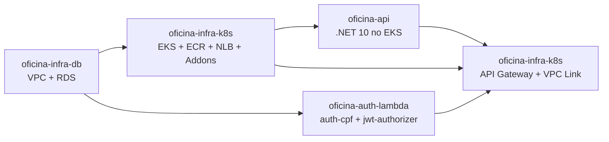
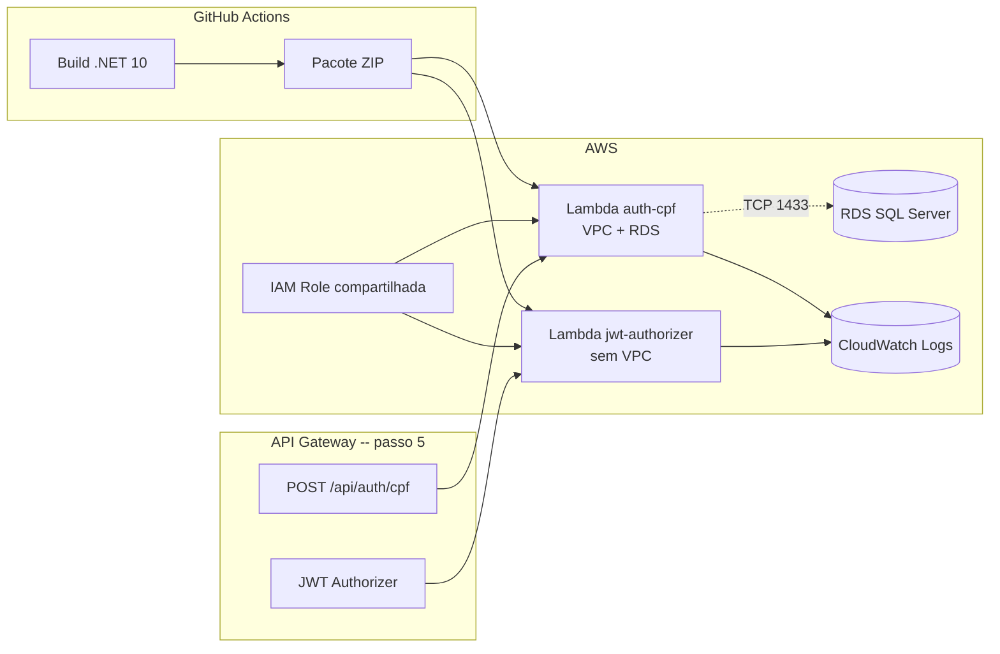

# oficina-auth-lambda

Funções serverless de autenticação e autorização da solução Oficina.

[]()
[]()
[]()
[]()

## Sumário

- 🎯 [Visão geral](#visão-geral)
- 🧩 [Solução integrada](#solução-integrada)
- 🏗️ [Arquitetura](#arquitetura)
- λ [As duas Lambdas](#as-duas-lambdas)
- 🔄 [Consumido e gerado](#consumido-e-gerado)
- 🔑 [Pré-requisitos manuais](#pré-requisitos-manuais)
- ⚙️ [Configuração](#configuração)
- ▶️ [Execução](#execução)
- ✅ [Validação](#validação)
- 💻 [Execução local](#execução-local)
- 📊 [Observabilidade](#observabilidade)
- ➡️ [Próxima etapa](#próxima-etapa)

---

## <a id="visão-geral"></a> 🎯 Visão geral

Duas funções Lambda em .NET 10:

- **`oficina-auth-cpf`**: valida CPF, consulta cliente ou funcionário no SQL Server e emite JWT.
- **`oficina-jwt-authorizer`**: valida JWT nas rotas protegidas do API Gateway.

Publicadas após o 1º deploy da API (RDS já migrado) e antes da criação do API Gateway.

- Workflow constrói o pacote ZIP, executa testes e empacota.
- Cria ou atualiza as duas funções na AWS (idempotente).
- Não cria a IAM Role das Lambdas (pré-requisito manual) nem o API Gateway (provisionado pelo passo 5 do `oficina-infra-k8s`).

**Tecnologias:** .NET 10, AWS Lambda (runtime `dotnet10`), AWS API Gateway Authorizer, AWS VPC e RDS SQL Server, CloudWatch Logs, GitHub Actions.

---

## <a id="solução-integrada"></a> 🧩 Solução integrada

A solução Oficina é composta por 4 repositórios que formam um sistema de gestão de oficina mecânica na AWS.



| Passo | Repositório | Quando |
|---|---|---|
| 1 | [oficina-infra-db](https://github.com/fabianorodrigues/oficina-infra-db) | sempre |
| 2 | [oficina-infra-k8s](https://github.com/fabianorodrigues/oficina-infra-k8s) — core + addons | sempre |
| 3 | [oficina-api](https://github.com/fabianorodrigues/oficina-api) — 1º deploy | sempre |
| **4** | **[oficina-auth-lambda](https://github.com/fabianorodrigues/oficina-auth-lambda)** | **sempre — este repositório** |
| 5 | [oficina-infra-k8s](https://github.com/fabianorodrigues/oficina-infra-k8s) — api-gateway | sempre |
| 6 | [oficina-api](https://github.com/fabianorodrigues/oficina-api) — redeploy | opcional, se `public-base-url` precisa entrar nos e-mails |
| 7 | [oficina-infra-k8s](https://github.com/fabianorodrigues/oficina-infra-k8s) — observability | opcional, após o passo 5 |

> [!NOTE]
> No passo 2, o Metrics Server é sempre instalado (HPA da API depende dele); o AWS Load Balancer Controller só é instalado quando `LOAD_BALANCER_PROVISIONING_MODE=aws_lbc`.

---

## <a id="arquitetura"></a> 🏗️ Arquitetura



---

## <a id="as-duas-lambdas"></a> λ As duas Lambdas

| Função | Memória | Timeout | VPC | Acesso ao RDS | Variáveis |
| --- | --- | --- | --- | --- | --- |
| `oficina-auth-cpf` | 256 MB | 15 s | sim | sim | JWT (4) + `ConnectionStrings__SqlServer` |
| `oficina-jwt-authorizer` | 256 MB | 5 s | não | não | apenas JWT (4) |

> [!NOTE]
> A função `auth-cpf` precisa de VPC para consultar o RDS. A `jwt-authorizer` apenas valida o token (operação local) — sem VPC fica mais rápida e sem cold start de ENI.

---

## <a id="consumido-e-gerado"></a> 🔄 Consumido e gerado

**Consome:**

| Origem | Valores |
| --- | --- |
| `oficina-infra-db` | `db_address`, `db_port` (compõem `DB_CONNECTION_STRING`), `lambda_subnet_id`, `lambda_security_group_id` |
| `oficina-api` (passo 3) | RDS já migrado (tabelas `Cliente` e `Funcionario`) |
| `oficina-api` | JWT (`JWT_SECRET`, `JWT_ISSUER`, `JWT_AUDIENCE`, `JWT_EXPIRATION_MINUTES`) — idênticos |

**Gera:**

| Saída | Consumido por |
| --- | --- |
| Funções Lambda `auth-cpf` e `jwt-authorizer` | api-gateway (passo 5) |
| CloudWatch Log Groups `/aws/lambda/<nome>` | observabilidade |

---

## <a id="pré-requisitos-manuais"></a> 🔑 Pré-requisitos manuais

> [!IMPORTANT]
> O workflow **não cria** a IAM Role. Crie a role uma vez e referencie pelo Secret `AWS_LAMBDA_ROLE_ARN`. As duas funções compartilham a mesma role.

| Item | Valor |
| --- | --- |
| Trust policy | `lambda.amazonaws.com` |
| Política gerenciada | `AWSLambdaBasicExecutionRole` (logs CloudWatch) |
| Política gerenciada | `AWSLambdaVPCAccessExecutionRole` (necessária para `auth-cpf`) |

> [!IMPORTANT]
> O **passo 3 (`oficina-api`) deve estar concluído** antes deste — sem o RDS migrado, a Lambda `auth-cpf` falha ao consultar `Cliente`/`Funcionario`.

Criar a role (PowerShell):

```powershell
$env:AWS_REGION="<regiao>"

$trust = @'
{
  "Version": "2012-10-17",
  "Statement": [
    { "Effect": "Allow", "Principal": { "Service": "lambda.amazonaws.com" }, "Action": "sts:AssumeRole" }
  ]
}
'@
$trust | Out-File -Encoding ascii -FilePath trust-lambda.json

aws iam create-role --role-name "oficina-auth-lambda-role" --assume-role-policy-document file://trust-lambda.json --query "Role.RoleName"

$basicPolicyArn = aws iam list-policies --scope AWS --query "Policies[?PolicyName=='AWSLambdaBasicExecutionRole'].Arn | [0]" --output text
$vpcPolicyArn = aws iam list-policies --scope AWS --query "Policies[?PolicyName=='AWSLambdaVPCAccessExecutionRole'].Arn | [0]" --output text

aws iam attach-role-policy --role-name "oficina-auth-lambda-role" --policy-arn $basicPolicyArn
aws iam attach-role-policy --role-name "oficina-auth-lambda-role" --policy-arn $vpcPolicyArn

aws iam get-role --role-name "oficina-auth-lambda-role" --query "Role.Arn" --output text
```

Use o ARN retornado no Secret `AWS_LAMBDA_ROLE_ARN`.

---

## <a id="configuração"></a> ⚙️ Configuração

Configure em **GitHub > Settings > Secrets and variables > Actions**.

> [!IMPORTANT]
> **JWT idêntico** ao [oficina-api](https://github.com/fabianorodrigues/oficina-api): se `JWT_SECRET`, `JWT_ISSUER`, `JWT_AUDIENCE` ou `JWT_EXPIRATION_MINUTES` divergir, tokens emitidos por estas Lambdas não são aceitos pela API.

### AWS e Role

| Nome | Tipo | Obrigatório | Descrição |
| --- | --- | --- | --- |
| `AWS_ACCESS_KEY_ID`, `AWS_SECRET_ACCESS_KEY`, `AWS_REGION` | Secret | sim | Credenciais AWS |
| `AWS_SESSION_TOKEN` | Secret | não | Credenciais temporárias (STS) |
| `AWS_LAMBDA_ROLE_ARN` | Secret | sim | ARN da IAM Role compartilhada (ver pré-requisitos) |

### VPC e banco

| Nome | Tipo | Obrigatório | Descrição |
| --- | --- | --- | --- |
| `DB_CONNECTION_STRING` | Secret | sim | Connection string SQL Server |
| `LAMBDA_SUBNET_IDS` | Secret | sim | IDs de subnets privadas em CSV |
| `LAMBDA_SECURITY_GROUP_IDS` | Secret | sim | IDs de Security Groups em CSV |

### JWT

| Nome | Tipo | Obrigatório | Descrição |
| --- | --- | --- | --- |
| `JWT_SECRET` | Secret | sim | Chave de assinatura (mínimo 32 caracteres) |
| `JWT_ISSUER` | Secret | sim | Issuer JWT |
| `JWT_AUDIENCE` | Secret | sim | Audience JWT |
| `JWT_EXPIRATION_MINUTES` | Secret | sim | Expiração em minutos |

### Nomes das funções

| Nome | Tipo | Default | Descrição |
| --- | --- | --- | --- |
| `AUTH_FUNCTION_NAME` | Variable | `oficina-auth-cpf` | Nome da Lambda de autenticação |
| `AUTHORIZER_FUNCTION_NAME` | Variable | `oficina-jwt-authorizer` | Nome da Lambda authorizer |

### Auto-provisionado pelo workflow

Criação ou atualização das duas Lambdas: runtime, memória, timeout, VPC config (apenas `auth-cpf`) e variáveis de ambiente.

### Como obter `LAMBDA_SUBNET_IDS` e `LAMBDA_SECURITY_GROUP_IDS`

```powershell
$env:AWS_REGION="<regiao>"
$env:PROJECT_NAME="oficina"

aws ec2 describe-subnets --region $env:AWS_REGION `
  --filters "Name=tag:Name,Values=*$($env:PROJECT_NAME)*private*" `
  --query "Subnets[*].SubnetId" --output text

aws ec2 describe-security-groups --region $env:AWS_REGION `
  --filters "Name=tag:Name,Values=*$($env:PROJECT_NAME)*lambda*" `
  --query "SecurityGroups[*].GroupId" --output text
```

Quando houver mais de um ID, separe por vírgula.

---

## <a id="execução"></a> ▶️ Execução

O deploy só pode ser disparado da branch `main`:

```text
GitHub Actions > Deploy Lambda > Run workflow
```

O workflow valida secrets e configuração, compila, testa, empacota, cria ou atualiza as duas Lambdas e valida a configuração final sem expor secrets, connection string, ARNs ou dados sensíveis.

---

## <a id="validação"></a> ✅ Validação

### Console

- **Lambda**: duas funções ativas, `LastUpdateStatus=Successful`.
- **`auth-cpf`**: VPC, subnets e Security Groups configurados.
- **`jwt-authorizer`**: ausência de VPC.
- **Configuration > Environment variables**: variáveis JWT presentes (sem expor valores).

### CLI (PowerShell)

```powershell
$env:AWS_REGION="<regiao>"
$env:AUTH_FUNCTION_NAME="oficina-auth-cpf"
$env:AUTHORIZER_FUNCTION_NAME="oficina-jwt-authorizer"
$lambdaConfigQuery = '{State:State,LastUpdateStatus:LastUpdateStatus,Runtime:Runtime,Timeout:Timeout,MemorySize:MemorySize,SubnetCount:length(not_null(VpcConfig.SubnetIds, `[]`)),SecurityGroupCount:length(not_null(VpcConfig.SecurityGroupIds, `[]`))}'

aws lambda get-function-configuration --function-name $env:AUTH_FUNCTION_NAME --region $env:AWS_REGION --query $lambdaConfigQuery
aws lambda get-function-configuration --function-name $env:AUTHORIZER_FUNCTION_NAME --region $env:AWS_REGION --query $lambdaConfigQuery
```

Esperado: `auth-cpf` com `SubnetCount >= 1` e `SecurityGroupCount >= 1`; `authorizer` com ambos `0`.

---

## <a id="execução-local"></a> 💻 Execução local

Não há Docker Compose. Localmente é possível apenas compilar e rodar testes unitários. Validação funcional requer Lambda já implantada.

```powershell
dotnet restore Oficina.AuthLambda.sln
dotnet build Oficina.AuthLambda.sln --configuration Release --no-restore
dotnet test Oficina.AuthLambda.sln --configuration Release --no-build
```

### Invocação com payloads (requer Lambdas implantadas)

Crie os arquivos na raiz do repositório.

`payload-cliente.json`:

```json
{
  "version": "2.0",
  "headers": { "content-type": "application/json" },
  "isBase64Encoded": false,
  "body": "{\"cpf\":\"<cpf-do-cliente>\"}"
}
```

`payload-authorizer.json`:

```json
{
  "version": "2.0",
  "headers": { "authorization": "Bearer <jwt-emitido-pela-auth-cpf>" }
}
```

Invocar:

```powershell
$env:AWS_REGION="<regiao>"
$env:AUTH_FUNCTION_NAME="oficina-auth-cpf"
$env:AUTHORIZER_FUNCTION_NAME="oficina-jwt-authorizer"

aws lambda invoke --function-name $env:AUTH_FUNCTION_NAME --region $env:AWS_REGION `
  --payload file://payload-cliente.json --cli-binary-format raw-in-base64-out `
  response-local.json; Get-Content response-local.json

aws lambda invoke --function-name $env:AUTHORIZER_FUNCTION_NAME --region $env:AWS_REGION `
  --payload file://payload-authorizer.json --cli-binary-format raw-in-base64-out `
  response-authorizer-local.json; Get-Content response-authorizer-local.json
```

---

## <a id="observabilidade"></a> 📊 Observabilidade

As Lambdas emitem logs estruturados em JSON no CloudWatch, com `correlationId = context.AwsRequestId`. Registram sucesso e falha de autenticação por CPF e `allow`/`deny`/falha do authorizer.

> [!TIP]
> Os logs não contêm CPF completo, senha, JWT, `Authorization` nem connection string. A redação acontece no `SafeLambdaLogger`.

### Configurar

Nenhum secret adicional. A IAM Role configurada como `AWS_LAMBDA_ROLE_ARN` já tem `AWSLambdaBasicExecutionRole` (pré-requisito), habilitando logs em CloudWatch automaticamente.

### Validar

**Console (CloudWatch > Logs > Log groups)**

- Invocar `auth-cpf` com payload válido: confirmar `eventType=AutenticacaoCpf`, `outcome=success`, `correlationId`.
- Invocar `auth-cpf` com payload inválido: confirmar `outcome=failure`, sem CPF completo.
- Invocar `jwt-authorizer` com token válido/inválido: confirmar `eventType=JwtAuthorizer`, `outcome=allow` ou `deny`.

**CLI (PowerShell)**

```powershell
$env:AWS_REGION="<regiao>"
$env:AUTH_FUNCTION_NAME="oficina-auth-cpf"

aws logs describe-log-streams --log-group-name "/aws/lambda/$($env:AUTH_FUNCTION_NAME)" `
  --region $env:AWS_REGION --order-by LastEventTime --descending --max-items 1 `
  --query "logStreams[0].logStreamName"

aws logs filter-log-events --log-group-name "/aws/lambda/$($env:AUTH_FUNCTION_NAME)" `
  --region $env:AWS_REGION --filter-pattern "eventType" --max-items 5 `
  --query "events[*].message"
```

---

## <a id="próxima-etapa"></a> ➡️ Próxima etapa

Aplicar o root `terraform/api-gateway` do [oficina-infra-k8s](https://github.com/fabianorodrigues/oficina-infra-k8s) — **passo 5** — para criar a entrada pública e integrar API, `auth-cpf` e `jwt-authorizer`. Depois que a URL pública estiver validada, o **passo 7 (observability)** pode ser aplicado como opcional.
